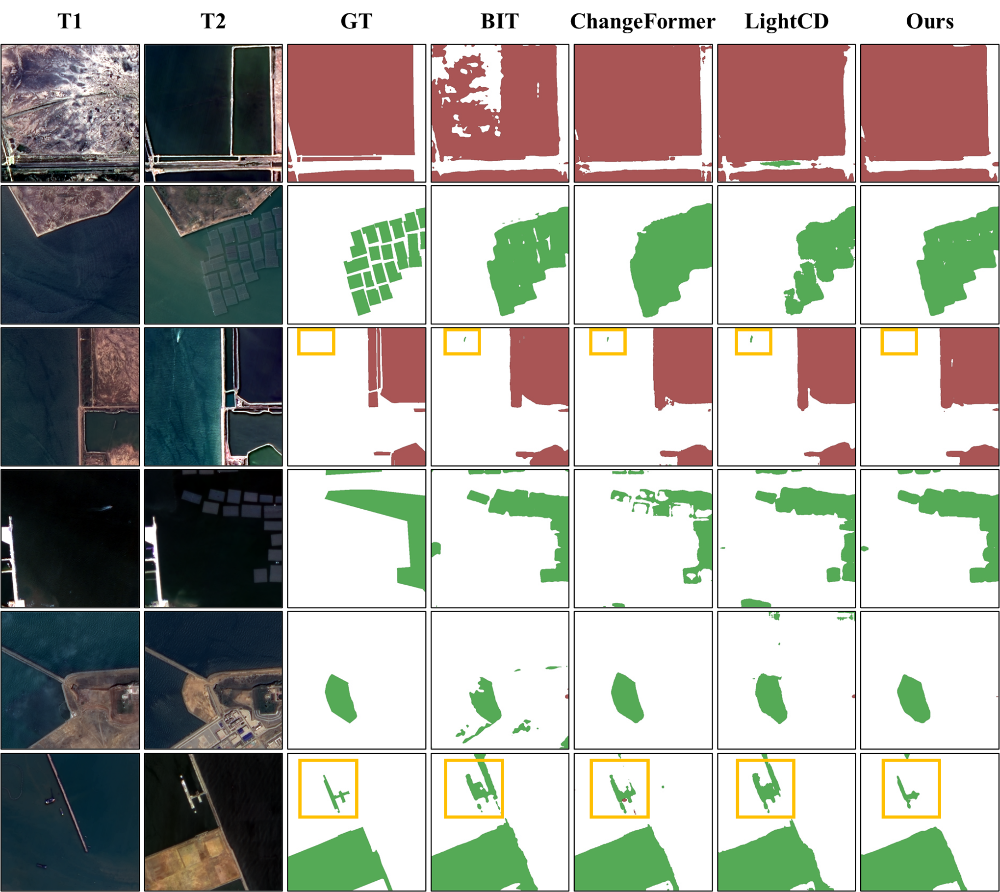

<h1 align="center"> Coast-CD: A Physics-Aware Network for Coastal Change Detection </h1>
<h5 align="center"><em>
    <a href="https://github.com/AI-Tianlong" target="_blank">Tianlong Ai</a>, 
    Tianzhu Liu, 
    Wenxin Tang,
    Yuqi Wang,
    Yiping Tian, 
    and Yanfeng Gu
</em></h5>
<h5 align="center"><em>
    Harbin Institute of Technology
</em></h5>

<!--
<p align="center">
  <a href="#Abstract">Abstract</a> |
  <a href="#📢-Latest-Updates ">News</a> |
  <a href="#🗺-MM-5B-Dataset">MM-5B</a> |
  <a href="#🌾-Crop10m-Dataset">Crop10m</a> |
  <a href="#🥰-Acknowledgement">Statement</a>
</p>
-->

<!-- <p align="center">
  <a href="https://arxiv.org/abs/2507.08741"></a>
</p> -->


## Abstract
Accurately monitoring anthropogenic coastal changes is challenging due to complex environmental interferences, such as tides and waves, and the scarcity of dedicated benchmark datasets. To address this, we propose the Coast-CD dataset, a large-scale, high-resolution dataset designed for coastal anthropogenic change detection. Furthermore, we present Coast-CDNet, a physics-aware network tailored for coastal change detection scenarios. By integrating a Physical Prior Injection Module, a Frequency Enhancement Branch, a Boundary Perception Branch, and a Dual-Stream Detection Head, our method achieves state-of-the-art performance on complex coastal change detection tasks. The code and dataset will be released at https://github.com/AI-Tianlong/Coast-CD.

---

## 📢 Latest Updates 
- **January-19-2026**: Coast-CD repository created. [](https://github.com/AI-Tianlong/Coast-CD)
<!-- - **July-11-2025**: The paper was released on arxiv. [](https://arxiv.org/abs/2507.08741) -->
## 📅 TODO List
- [ ] Release Coast-CD dataset
- [ ] Release Coast-CDNet code
- [ ] Release Coast-CDNet weights

> ℹ️ The dataset will be released immediately after further manual verification. The code and weights will be released once the paper is accepted.


## 🗺 Coast-CD Dataset

<p align="center">
  
</p>

<p>
Coast-CD download links: 
  <a href="https://pan.baidu.com/s/1U5yjf7t1-RuaWMPOhSA1ow?pwd=MM5B"> Baidu Netdisk</a> |
  <a href="#"> Google Drive</a> |
  <a href="#"> Zenodo</a>
</p>


## Visualization
Experimental Results Visualization on the Coast-CD Dataset.



<!-- ## 🥰 Acknowledgement

## 📜 Citation
if you find it helpful, please cite
```bibtex
@article{Coast-CD_2025,
  title={HieraRS: A Hierarchical Segmentation Paradigm for Remote Sensing Enabling Multi-Granularity Interpretation and Cross-Domain Transfer},
  author={Tianlong Ai, Tianzhu Liu, Haochen Jiang and Yanfeng Gu},
  journal={arXiv preprint arXiv:2507.08741},
  year={2025}
}
``` -->

## 🌟Stargazers over time


